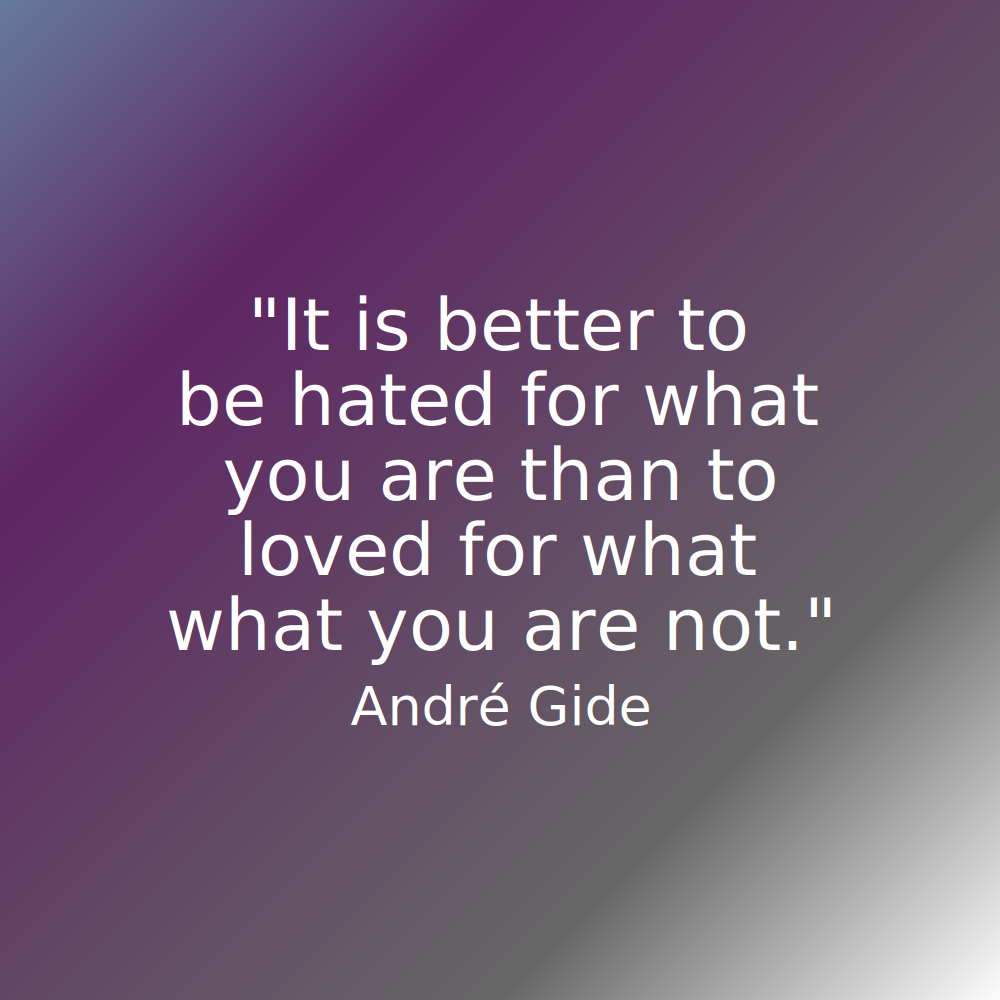
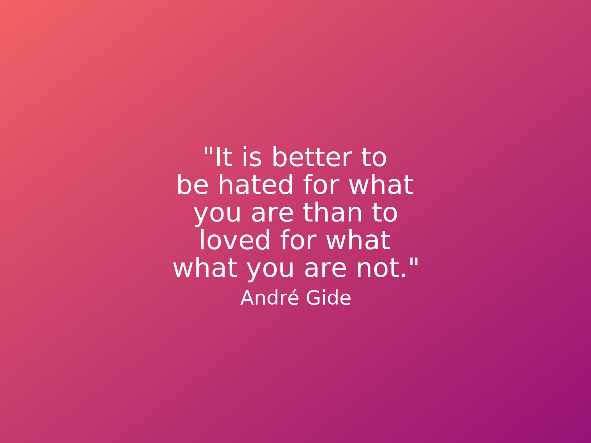
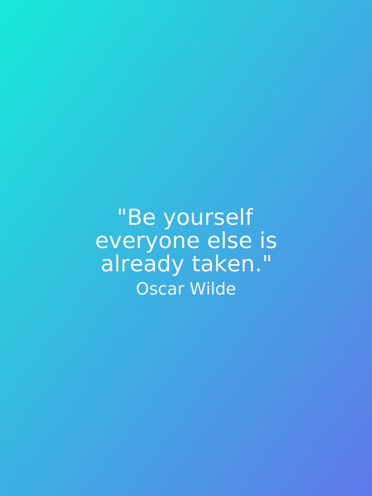
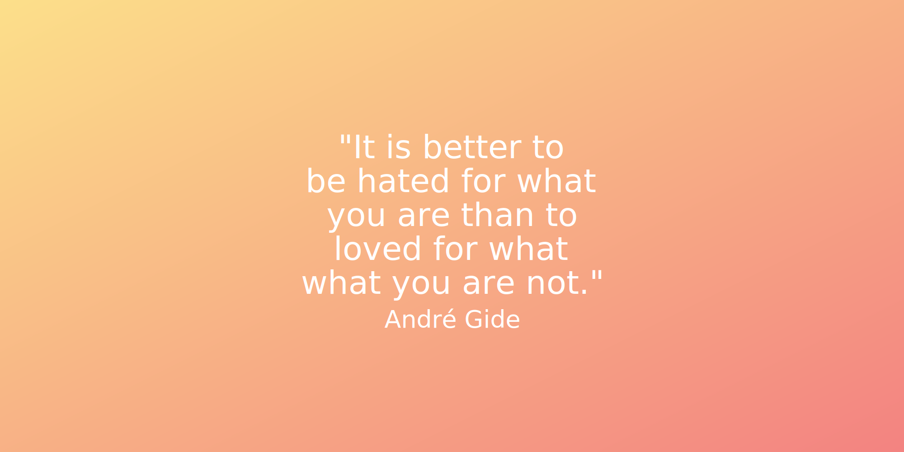
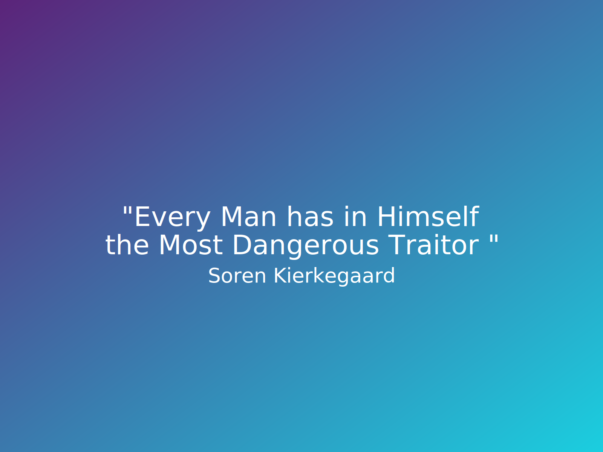

# Aurora

[](https://goreportcard.com/report/github.com/gostudent/aurora)
[](https://opencode18.github.io)
[](https://www.codacy.com/app/gostudent/aurora)
[](https://godoc.org/github.com/gostudent/aurora)
[](https://travis-ci.org/gostudent.aurora)

A Package to create quote images

## Installation

`go get github.com/gostudent/aurora`

## Usage

### To Generate Square Image by Using a Custom Gradient:

```go
package main

import (
	"github.com/gostudent/aurora"
)

func main() {
	quote := []string{"It is better to", "be hated for what", "you are than to",
		"loved for what", "what you are not."}
	author := "André Gide"
	filename := "2"
	lg := []aurora.Color{{0, "#65799b", 1.0}, {25, "#5e2563", 1.0}, {75, "#66666", 1.0}, {100, "#fafafa", 1.0}}
	aurora.CreateSquare(filename, quote, author, lg)
}
```




### To Generate Landscape Image by Using a Pre-defined Gradient

```go
package main

import (
	"github.com/gostudent/aurora"
)

func main() {
	quote := []string{"It is better to", "be hated for what", "you are than to",
		"loved for what", "what you are not."}
	author := "André Gide"
	filename := "2"
	lg := aurora.Gradients[7].Colors
	aurora.CreateLand(filename, quote, author, lg)
}
```




### To Generate Portrait Image by Using a Pre-defined Gradient

```go
package main

import (
	"github.com/gostudent/aurora"
)

func main() {
	quote := []string{"Be yourself", "everyone else is", "already taken."}
	author := "Oscar Wilde"
	filename := "1"
	lg := aurora.Gradients[7].Colors
	aurora.CreatePort(filename, quote, author, lg)
}
```



### To Generate Image with Custom Dimensions 

```go
package main

import (
	"github.com/gostudent/aurora"
)

func main() {
	quote := []string{"It is better to", "be hated for what", "you are than to",
		"loved for what", "what you are not."}
	author := "André Gide"
	filename := "2"
	lg := aurora.Gradients[7].Colors
	aurora.Create(filename, quote, author, 1000, 2000, lg)
}
```



## Terminal App 
### How To

 Main functionality of the application will be shown here.<br />
 Make sure you are in correct folder.
 
 To see the help, run: 

```bash
aurora -h
```

### Options
```bash
   --quote value, -q value        quote that will go in the image (default: "Default quote template.")
   --author value, -a value       Author of the quote (default: "Anonymous")
   --filename value, -f value     name of the file (default: "quote")
   --orientation value, -o value  Orientation. 0 - Square (600 X 600) , 1 - Landscape  and  2 - Portrait (default: "0")
   --gradient value, -g value     Gradient : 0-22 integer input. (default: "0")
   --help, -h                     show help
   --version, -v                  print the version

```
### Example Command

```bash
aurora -q "Every Man has in Himself the Most Dangerous Traitor of All." -a "Soren Kierkegaard" -f "example1" -o 1 -g 9

```



