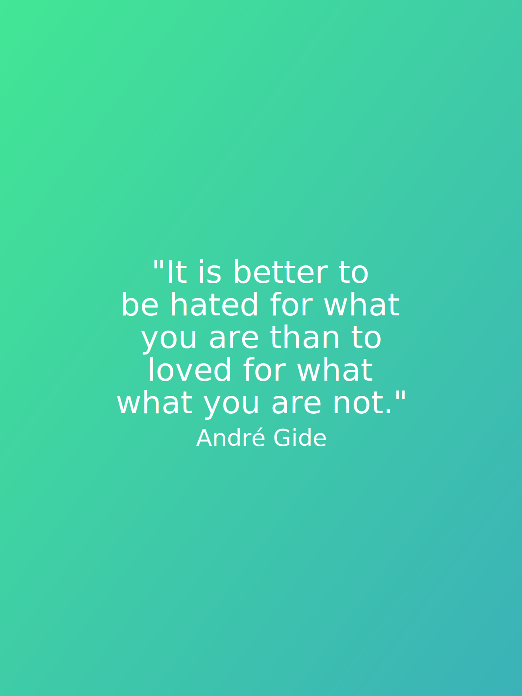

# Aurora

[](https://opencode18.github.io)
[](https://www.codacy.com/app/gostudent/aurora)
[](https://godoc.org/github.com/gostudent/aurora)
[](https://travis-ci.org/gostudent.aurora)

A Package to create quote images

## Installation

`go get github.com/gostudent/aurora`

## Usage

```go
package main

import (
	"github.com/gostudent/aurora"
)

func main() {
	quote := []string{"It is better to", "be hated for what", "you are than to",
		"loved for what", "you are not."}
	author := "André Gide"
	filename := "something"
	aurora.Create(filename, quote, author)
}
```


